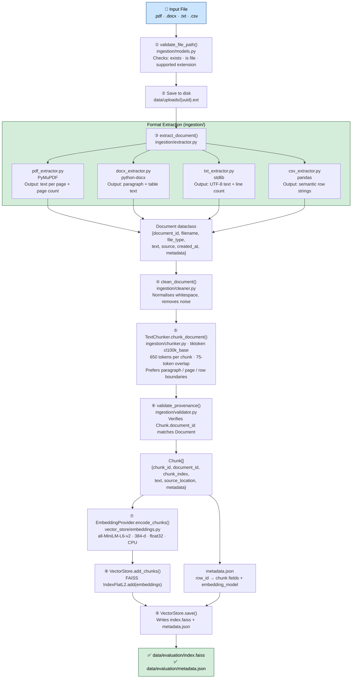

# Ingestion Pipeline — How Documents Enter the Knowledge Base

Documents are processed **once at build time** and persisted to disk.
At query time the index is loaded read-only — no re-embedding happens on every request.

> 🟢 All steps below are **implemented in M1**.

---

## 1. Pipeline Overview

```
Raw file
  │
  ▼
① Validate          — check extension (.pdf · .docx · .txt · .csv) and file exists
  │
  ▼
② Extract           — format-specific library pulls text + metadata
  │
  ▼
③ Clean             — normalise whitespace, collapse blank lines, strip noise
  │
  ▼
④ Chunk             — split into overlapping token windows (650 tokens, 75 overlap)
  │
  ▼
⑤ Validate provenance — verify every Chunk links back to its parent Document
  │
  ▼
⑥ Embed             — encode each chunk with all-MiniLM-L6-v2 → 384-d float32 vector
  │
  ▼
⑦ Index             — add vectors to FAISS IndexFlatL2; write metadata.json
  │
  ▼
⑧ Persist           — save index.faiss + metadata.json to disk
```

---

## 2. Detailed Flow Diagram



---

## 3. Extraction by Format

| Format | Library | Text Output | Key Metadata |
|---|---|---|---|
| **PDF** | PyMuPDF | Full text per page, pages joined with `\n\n` | `page_count`, `page_texts[]`, `has_text` |
| **DOCX** | python-docx | Paragraphs + table cells in body order | `paragraph_count`, `table_count` |
| **TXT** | Python stdlib | Raw UTF-8 text preserved | `line_count`, `char_count` |
| **CSV** | pandas | `"Column: Value"` strings, one per row | `row_count`, `column_names`, `row_number` per chunk |

---

## 4. Chunking Parameters

| Parameter | Value | Why |
|---|---|---|
| Chunk size target | **650 tokens** | Balances context richness vs embedding noise |
| Chunk overlap | **75 tokens** | Preserves cross-boundary context |
| Max chunk size | **800 tokens** | Hard cap; oversized segments are token-sliced |
| Tokeniser | **tiktoken `cl100k_base`** | Deterministic, matches GPT token counts |
| Boundary preference | Paragraph → Page → Row → Token window | Keeps semantic units intact |

---

## 5. Entry Points

| Script / Endpoint | What it does |
|---|---|
| `generate_evaluation_corpus.py` | Generates synthetic PDF/DOCX/TXT/CSV files for 2 domains |
| `index_evaluation_corpus.py` | Runs full pipeline → writes `data/evaluation/index.faiss` |
| `generate_samples.py` | Generates older HR / technical sample files |
| `index_samples.py` | Runs full pipeline → writes `data/index.faiss` |
| `run_pipeline.py` | Smoke-test: extract → clean → chunk → validate (no FAISS write) |
| `POST /upload` | HTTP upload → full `ingestion/pipeline.py` → FAISS + metadata |

`POST /upload` uses the same production validation, extraction, cleaning,
token-aware chunking, embedding, and indexing path as the evaluation pipeline.

---

## 6. Duplicate Source Guard

`VectorStore.index_document()` checks `source_location` before indexing.
If the same file is uploaded again, the old chunks are **removed and replaced** — no duplicates accumulate.

---

## 7. Module Map

| Step | Module | Key function / class |
|---|---|---|
| Validation | `ingestion/models.py` | `validate_file_path()` |
| Dispatch | `ingestion/extractor.py` | `extract_document()` |
| PDF | `ingestion/pdf_extractor.py` | `PdfExtractor.extract()` |
| DOCX | `ingestion/docx_extractor.py` | `DocxExtractor.extract()` |
| TXT | `ingestion/txt_extractor.py` | `TxtExtractor.extract()` |
| CSV | `ingestion/csv_extractor.py` | `CsvExtractor.extract()` |
| Cleaning | `ingestion/cleaner.py` | `clean_document()` |
| Chunking | `ingestion/chunker.py` | `TextChunker.chunk_document()` |
| Provenance | `ingestion/validator.py` | `validate_provenance()` |
| Embedding | `vector_store/embeddings.py` | `EmbeddingProvider.encode_chunks()` |
| Indexing | `vector_store/store.py` | `VectorStore.index_document()` |
| Full pipeline | `ingestion/pipeline.py` | `ingest_file()`, `index_file()` |
