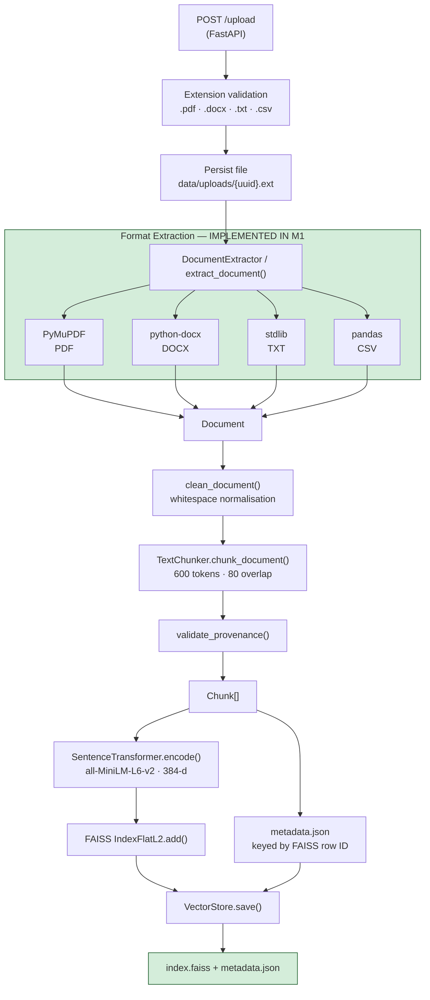

# Ingestion Flow — Knowledge Base Build

Documents are processed **once at upload time** and persisted for query-time retrieval.

**Status:** Pipeline core — **IMPLEMENTED IN M1**; full pipeline wired through API — partial
(`app.py` uses a simplified chunk path; `index_samples.py` uses the full pipeline).

---

## 1. Flow Diagram

---

## 2. Component Map

| Step | Module | Status |
|---|---|---|
| HTTP upload | `app.py` | **IMPLEMENTED IN M1** |
| File validation | `ingestion/extractor.py`, `models.py` | **IMPLEMENTED IN M1** |
| PDF extraction | `ingestion/pdf_extractor.py` (PyMuPDF) | **IMPLEMENTED IN M1** |
| DOCX extraction | `ingestion/docx_extractor.py` (python-docx) | **IMPLEMENTED IN M1** |
| TXT extraction | `ingestion/txt_extractor.py` | **IMPLEMENTED IN M1** |
| CSV extraction | `ingestion/csv_extractor.py` (pandas) | **IMPLEMENTED IN M1** |
| Cleaning | `ingestion/cleaner.py` | **IMPLEMENTED IN M1** |
| Chunking | `ingestion/chunker.py` (tiktoken) | **IMPLEMENTED IN M1** |
| Provenance validation | `ingestion/validator.py` | **IMPLEMENTED IN M1** |
| Embedding | `vector_store/store.py`, `embeddings.py` | **IMPLEMENTED IN M1** |
| Index persistence | `vector_store/store.py` | **IMPLEMENTED IN M1** |
| Batch re-index | `index_samples.py` | **IMPLEMENTED IN M1** |
| Semantic / adaptive chunking | — | **FUTURE MILESTONES** |
| OCR / image extraction | — | **FUTURE MILESTONES** |

---

## 3. Supported Formats

| Format | Library | Output |
|---|---|---|
| PDF | PyMuPDF | Page text + page count metadata |
| DOCX | python-docx | Paragraph/table text + counts |
| TXT | Python stdlib | Raw text + line count |
| CSV | pandas | Semantic row strings + column metadata |

---

## 4. Chunking Baseline (M1)

| Parameter | Value | Status |
|---|---|---|
| Chunk size | 600 tokens | **IMPLEMENTED IN M1** |
| Overlap | 80 tokens | **IMPLEMENTED IN M1** |
| Encoder | tiktoken `cl100k_base` | **IMPLEMENTED IN M1** |

---

## 5. Data Produced

| Artifact | Schema | Status |
|---|---|---|
| Extracted document | `Document` | **IMPLEMENTED IN M1** |
| Index segment | `Chunk` | **IMPLEMENTED IN M1** |
| Dense vector | `Embedding` | **IMPLEMENTED IN M1** (stored in FAISS, not separate file) |

See [`../docs/data-models.md`](../docs/data-models.md) for field-level definitions.
