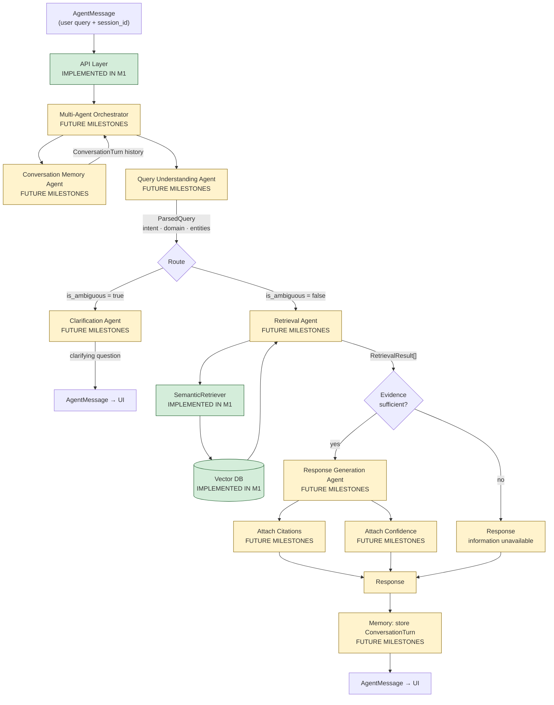
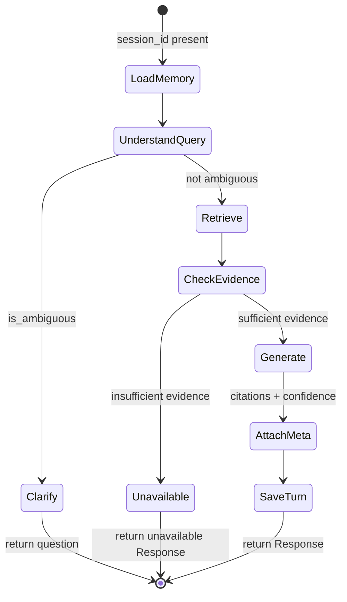
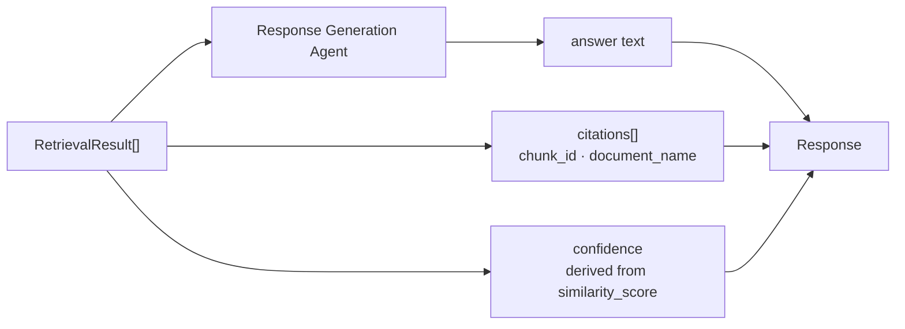

# Multi-Agent Orchestration

The orchestrator coordinates specialised agents between the API and the retrieval core.
**No agent runtime code exists in M1** — this document defines the target architecture
that wraps **IMPLEMENTED IN M1** retrieval components.

---

## 1. Orchestrator Pipeline

---

## 2. Agent Responsibilities

| Agent | Input | Output | Status |
|---|---|---|---|
| **Multi-Agent Orchestrator** | `AgentMessage` | `Response` or clarification `AgentMessage` | **FUTURE MILESTONES** |
| **Conversation Memory Agent** | session history | enriched context, stored `ConversationTurn` | **FUTURE MILESTONES** |
| **Query Understanding Agent** | raw query + context | intent, domain, entities, `is_ambiguous` | **FUTURE MILESTONES** |
| **Clarification Agent** | ambiguity signal | clarifying question string | **FUTURE MILESTONES** |
| **Retrieval Agent** | parsed query, `top_k` | `RetrievalResult[]` | **FUTURE MILESTONES** (wraps **IMPLEMENTED IN M1** `SemanticRetriever`) |
| **Response Generation Agent** | query + evidence | `Response` with answer | **FUTURE MILESTONES** |

---

## 3. Routing Rules (Planned)

**Status:** **FUTURE MILESTONES**

---

## 4. Query Understanding — Intent Taxonomy

| Intent | Example | Used in M1 eval |
|---|---|---|
| Factual | "How many leave days?" | Yes |
| Procedural | "How do I apply for leave?" | Yes |
| Comparative | "Difference between Annual and Sick carry-forward?" | Yes |
| Unavailable | "What was revenue in 2025?" | Yes (negative test) |

Intent classification logic — **FUTURE MILESTONES**; eval harness labels — **IMPLEMENTED IN M1**.

---

## 5. Evidence Sufficiency (Future)

The orchestrator will reject weak matches before generation:

| Signal | Mechanism | Status |
|---|---|---|
| Top-1 L2 distance | Threshold gate | **FUTURE MILESTONES** |
| Domain mismatch | Query Understanding output vs chunk metadata | **FUTURE MILESTONES** |
| Empty index | Zero vectors | **IMPLEMENTED IN M1** (returns `[]`) |

---

## 6. Citations and Confidence

| Field | Producer | Status |
|---|---|---|
| `citations[]` | Response Generation Agent | **FUTURE MILESTONES** |
| `confidence` | Orchestrator / RG from retrieval scores | **FUTURE MILESTONES** |
| `similarity_score` (raw L2) | `VectorStore.search()` | **IMPLEMENTED IN M1** |

---

## 7. Planned Module Layout

| File (planned) | Role | Status |
|---|---|---|
| `agents/orchestrator.py` | State machine / LangGraph router | **FUTURE MILESTONES** |
| `agents/query_understanding.py` | Intent + domain + ambiguity | **FUTURE MILESTONES** |
| `agents/retrieval_agent.py` | Wraps `SemanticRetriever` | **FUTURE MILESTONES** |
| `agents/response_generation.py` | LLM grounded answer | **FUTURE MILESTONES** |
| `agents/clarification.py` | Clarifying questions | **FUTURE MILESTONES** |
| `agents/memory.py` | Session history | **FUTURE MILESTONES** |

Design reference: [`../agents/README.md`](../agents/README.md)
