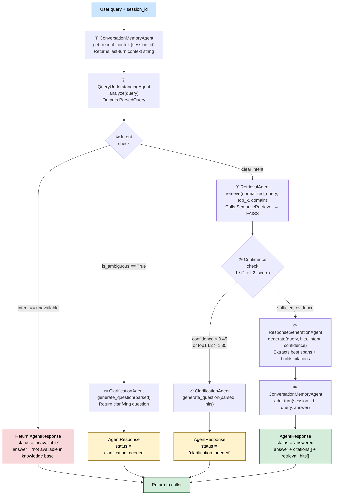
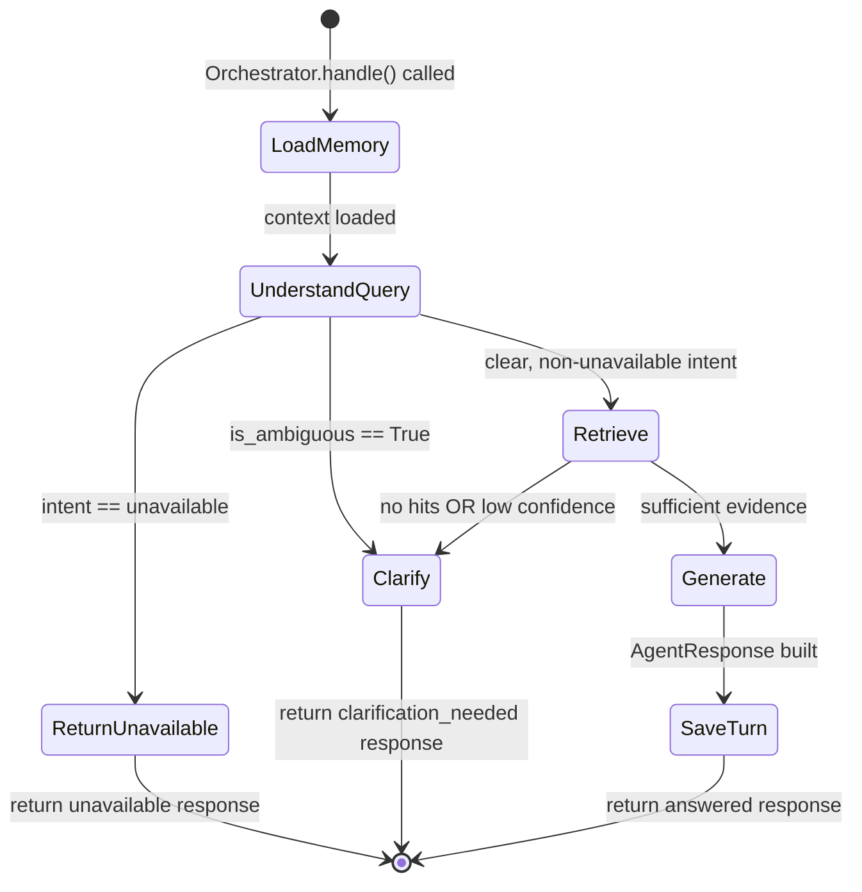

# Multi-Agent Orchestration — Agent Design and Routing Logic

All five agents and the orchestrator are **implemented in M1.4** as plain Python classes
(no LangGraph, no external agent framework). Each agent has a single, focused responsibility.

> 🟢 = Implemented in M1.4 · 🟡 = Planned for future milestone

---

## 1. Agent Roster

| Agent | Module | Role | LLM? |
|---|---|---|---|
| **Orchestrator** | `agents/orchestrator.py` | Coordinates the full pipeline; routes by intent and confidence | No |
| **QueryUnderstandingAgent** | `agents/query_understanding.py` | Normalises text, classifies intent, detects domain, flags ambiguity | No |
| **RetrievalAgent** | `agents/retrieval_agent.py` | Calls `SemanticRetriever`, normalises raw results to `RetrievalHit[]` | No |
| **ResponseGenerationAgent** | `agents/response_generation.py` | Extracts best spans from hits, builds answer + `[source: …]` citations | No |
| **ClarificationAgent** | `agents/clarification.py` | Generates a clarifying question when query is vague or evidence is weak | No |
| **ConversationMemoryAgent** | `agents/memory.py` | Stores and retrieves last-N turns per `session_id` | No |

---

## 2. Orchestrator Routing Diagram



---

## 3. Agent Contracts

### QueryUnderstandingAgent

**Input:** raw query string
**Output:** `ParsedQuery`

| Field | Type | Description |
|---|---|---|
| `raw_query` | `str` | Original user text |
| `normalized_query` | `str` | Whitespace-normalised text |
| `intent` | `str` | `factual` · `procedural` · `comparative` · `unavailable` |
| `domain` | `str \| None` | `"Software Engineering"` · `"Hospital Administration"` · `None` |
| `is_ambiguous` | `bool` | True if query is ≤2 words or uses vague pronouns |

**Classification rules (no LLM):**
```
unavailable  ← matches: "revenue", "CEO", "fiscal year", "Nobel Prize", "invented … year"
comparative  ← matches: "differ", "difference", "compare", "versus", "vs", "contrast"
procedural   ← matches: "how do/to/should/can", "steps to", "procedure", "protocol"
factual      ← default (everything else)
```

---

### RetrievalAgent

**Input:** `normalized_query`, `top_k`, optional `domain` filter
**Output:** `RetrievalHit[]`

| Field | Type | Description |
|---|---|---|
| `rank` | `int` | 1-based position in results |
| `score` | `float` | L2 distance (lower = closer match) |
| `text` | `str` | Chunk body text |
| `filename` | `str` | Source document filename |
| `document_id` | `str` | UUID of parent document |
| `chunk_id` | `str` | `{document_id}_{chunk_index}` |
| `metadata` | `dict` | Domain, file_type, token counts |

**Domain filtering:** if `domain` is set, hits from other domains are filtered out.
If filtering yields zero hits, all hits are returned (fallback).

---

### ResponseGenerationAgent

**Input:** query, `RetrievalHit[]`, intent, confidence, domain
**Output:** `AgentResponse`

**Answer construction by intent:**

| Intent | Answer format |
|---|---|
| `factual` | Best-matching excerpt from top hit |
| `procedural` | `"Procedure from {filename}: {excerpt}"` |
| `comparative` | `"Based on the knowledge base: {excerpt1} Additionally: {excerpt2}"` |

All answers append `[source: {filenames}]` citation markers.
Up to 3 citations (one per top-3 hits) are attached.

---

### ClarificationAgent

**Input:** `ParsedQuery`, `RetrievalHit[]`, confidence
**Output:** Clarifying question string

| Condition | Generated question |
|---|---|
| No domain detected | "Could you specify whether your question relates to Software Engineering or Hospital Administration?" |
| Query is ambiguous | "Your question seems broad. Could you provide more detail about what you need regarding {domain}?" |
| No hits found | "I could not find relevant documents. Could you rephrase or add more context?" |
| Low confidence | "I found only weakly related information. Could you clarify the specific topic?" |

---

### ConversationMemoryAgent

**Input / Output:** per-session turn history (in-memory, not persisted to disk)

- Stores up to `max_turns=5` turns per `session_id`
- `get_recent_context()` returns a string: `"Previous question: … Previous answer: …"`
- Used by the Orchestrator to enrich ambiguous follow-up queries

---

## 4. State Machine (Routing Logic)



---

## 5. Response Schema

Every code path returns an `AgentResponse`:

| Field | Type | Description |
|---|---|---|
| `answer` | `str` | Answer text, clarifying question, or unavailability message |
| `citations` | `Citation[]` | Source references (chunk_id, filename, excerpt) |
| `status` | `str` | `"answered"` · `"unavailable"` · `"clarification_needed"` |
| `intent` | `str` | Intent from `QueryUnderstandingAgent` |
| `confidence` | `float` | Normalised `1 / (1 + L2_score)` from top-1 hit |
| `retrieval_hits` | `RetrievalHit[]` | Full ranked hit list for transparency |
| `domain` | `str \| None` | Detected or inferred domain |
| `clarification_question` | `str \| None` | Set when `status="clarification_needed"` |

---

## 6. Module Layout

```
agents/
├── __init__.py              # Public exports for all agents
├── orchestrator.py          # Orchestrator — coordinates full pipeline
├── query_understanding.py   # QueryUnderstandingAgent — intent + domain
├── retrieval_agent.py       # RetrievalAgent — wraps SemanticRetriever
├── response_generation.py   # ResponseGenerationAgent — extractive answers
├── clarification.py         # ClarificationAgent — clarifying questions
├── memory.py                # ConversationMemoryAgent — session history
└── models.py                # Shared dataclasses: ParsedQuery, RetrievalHit,
                             #   Citation, AgentResponse, ConversationTurn
```

---

## 7. What Is NOT in M1 (Future Milestones)

| Feature | Why deferred |
|---|---|
| LLM-grounded answers | OpenAI / local model adds cost and latency; retrieval validated first |
| `POST /chat` endpoint | Will wire Orchestrator to the API in M2 |
| Similarity threshold tuning | Needs calibration data from real user queries |
| Cross-encoder re-ranking | Improves precision but requires a second model |
| Persistent session store | Redis / SQLite for multi-user, multi-process memory |
| Autonomous agent planning | LangGraph or custom FSM for multi-hop queries |
