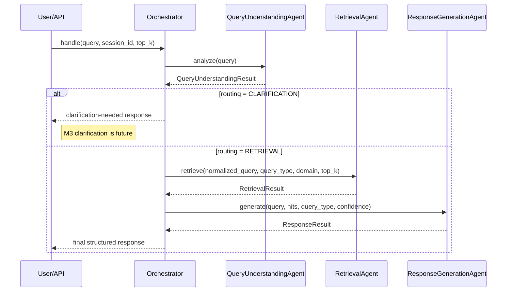

# M2 Orchestration — M2 COMPLETED

The implementation is a fixed sequential pipeline of plain Python classes. It
does not use LangChain, LangGraph, autonomous planning, or agent-to-agent
negotiation.

## Implemented sequence

`ConversationMemoryAgent` records turns but is not an additional resolution stage.
Every completed response carries a generated `request_id`.

## M2.1 Query understanding

The rule-based classifier returns exactly:

- `factual`
- `procedural`
- `comparative`
- `ambiguous`

It also returns deterministic application-level classification confidence,
detected domain, reason, and routing. Factual/procedural/comparative route to
retrieval. Ambiguous routes to clarification. Unavailable information is not an
intent; retrieval evidence determines availability.

## M2.2 Retrieval handoff

`RetrievalResult` contains the normalized query type, requested Top-K, ranked
`RetrievalHit` values, filtered count, retrieval confidence, evidence sufficiency,
and no-relevant-information state. Each hit preserves text, filename, document ID,
chunk ID, metadata, L2 distance, and derived relevance.

FAISS L2 distance is lower-is-better. The application relevance representation is
`1 / (1 + distance_score)`.

## M2.3 Response handoff

`ResponseGenerationAgent` receives retrieved hits and retrieval confidence. When
an LLM provider is configured, its prompt requires context-only answers, no
outside knowledge, explicit insufficient evidence, and citations only from
retrieved metadata. Missing or low evidence returns a controlled response.

Confidence levels are application-level labels:

- `HIGH`: confidence >= 0.75
- `MEDIUM`: 0.45 <= confidence < 0.75
- `LOW`: confidence < 0.45

They are not calibrated probabilities.

## Error handling

Classification, retrieval, generation, and malformed-output failures return a
structured `AgentError` with the failing agent, code, and message. The API maps
these failures to HTTP 500 responses.

## Future: M3 and later

The current clarification response is intentionally minimal. Rich follow-up
questions, multi-turn clarification state, and autonomous planning are future
work.
