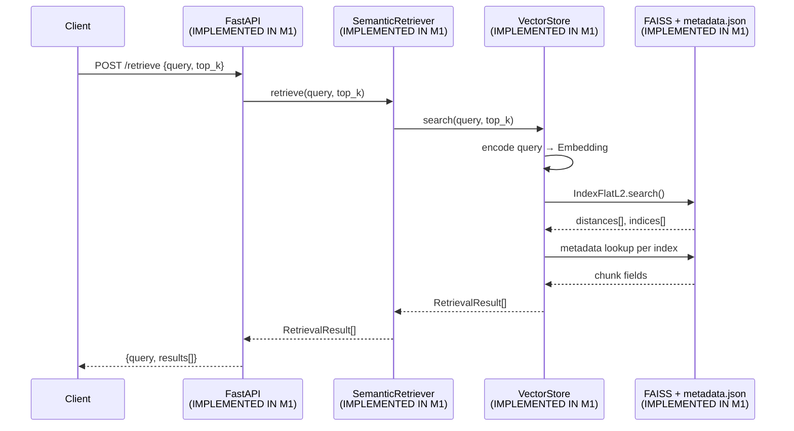
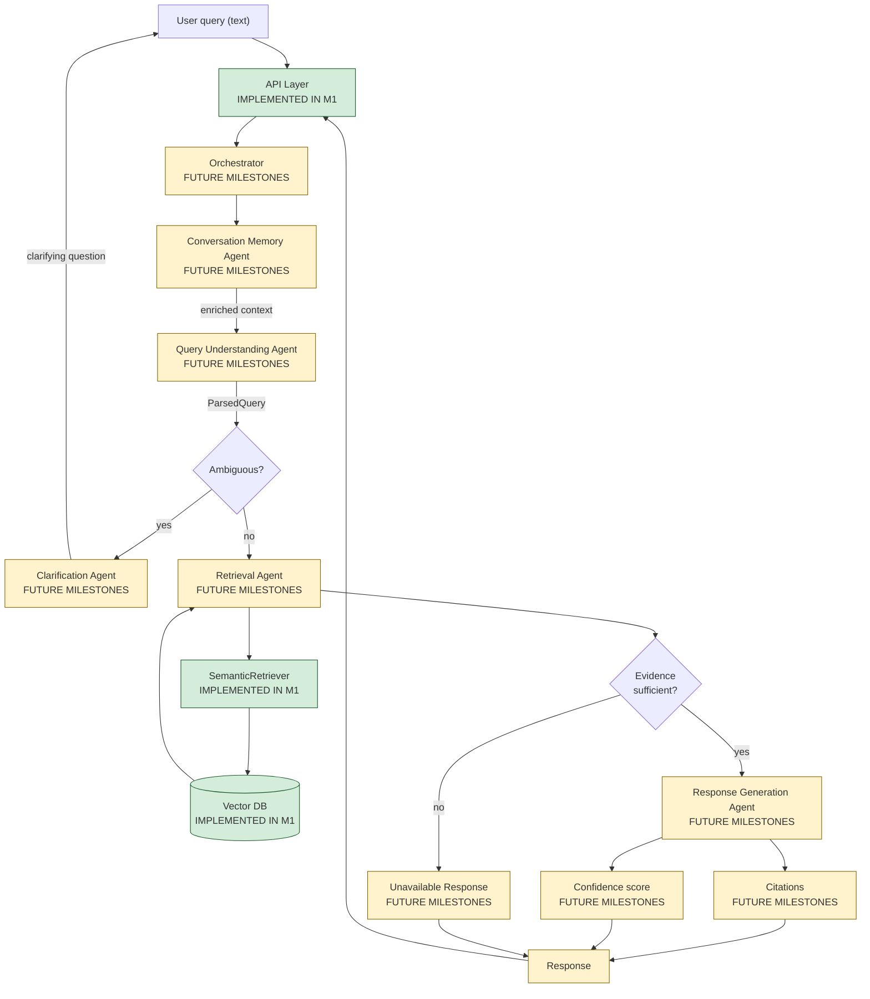

# RAG Query Flow — Retrieval Pipeline

Query processing retrieves ranked evidence chunks from the vector index. In M1 the
API calls retrieval **directly**; future milestones route through the agent layer.

---

## 1. M1 Query Flow (Implemented)

---

## 2. Target Query Flow (Future Multi-Agent)

---

## 3. Retrieval Parameters (M1)

| Parameter | Value | Status |
|---|---|---|
| Embedding model | `all-MiniLM-L6-v2` | **IMPLEMENTED IN M1** |
| Dimensions | 384 | **IMPLEMENTED IN M1** |
| Distance metric | L2 (Euclidean) | **IMPLEMENTED IN M1** |
| Default top_k | 3 | **IMPLEMENTED IN M1** |
| Evaluated top_k | 1, 3, 5 | **IMPLEMENTED IN M1** |
| Similarity threshold (reject low-confidence) | — | **FUTURE MILESTONES** |
| Re-ranking | — | **FUTURE MILESTONES** |

---

## 4. API Contract (M1)

| Endpoint | Method | Input | Output | Status |
|---|---|---|---|---|
| `/health` | GET | — | `{status}` | **IMPLEMENTED IN M1** |
| `/upload` | POST | multipart file | `document_id`, `chunk_count` | **IMPLEMENTED IN M1** |
| `/retrieve` | POST | `Query` | `RetrievalResult[]` | **IMPLEMENTED IN M1** |
| `/chat` (orchestrated answer) | POST | `Query` + session | `Response` | **FUTURE MILESTONES** |

---

## 5. Evaluation Harness

`evaluate_retrieval.py` runs 8 labelled queries across HR and Software domains,
reporting Hit@1, Hit@3, Hit@5. Results recorded in `docs/validation.md`.

**Status:** **IMPLEMENTED IN M1**

---

## 6. Citations and Confidence (Future)

| Signal | Source | Status |
|---|---|---|
| `similarity_score` (L2 distance) | `VectorStore.search()` | **IMPLEMENTED IN M1** (raw distance only) |
| Normalised confidence (0–1) | Derived from distance + threshold | **FUTURE MILESTONES** |
| Inline citations in answer | Response Generation Agent | **FUTURE MILESTONES** |
| "Information unavailable" guard | Orchestrator + RG Agent | **FUTURE MILESTONES** |
