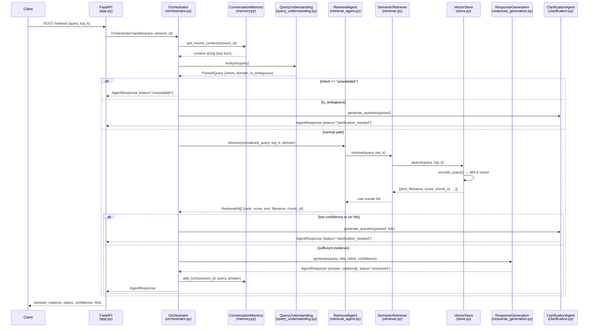

# RAG Query Flow — From User Question to Answer

A query enters as plain text, passes through the agent pipeline, and returns
a sourced, ranked answer. The whole pipeline runs **without an LLM** in M1 —
answers are extractive (copied from retrieved chunks).

> 🟢 All steps below are **implemented in M1.4** unless marked otherwise.

---

## 1. High-Level Flow

```
User query (text)
  │
  ▼
① API Layer             — FastAPI POST /retrieve or Python Orchestrator.handle()
  │
  ▼
② Conversation Memory   — load last-N turns for this session_id (context enrichment)
  │
  ▼
③ Query Understanding   — classify intent, detect domain, flag ambiguity
  │
  ├─── ambiguous? ──────► Clarification Agent → return clarifying question
  │
  ├─── intent = unavailable? ──► return "not available in knowledge base"
  │
  ▼
④ Retrieval Agent       — embed query, search FAISS, return ranked hits
  │
  ├─── no hits or low confidence? ──► Clarification Agent → return clarifying question
  │
  ▼
⑤ Response Generation   — select best excerpt per hit, build answer + citations
  │
  ▼
⑥ Memory               — store this turn (query + answer) for session continuity
  │
  ▼
AgentResponse           — {answer, citations, status, intent, confidence, hits}
```

---

## 2. Detailed Sequence Diagram



---

## 3. Intent Classification

The `QueryUnderstandingAgent` classifies every query into one of four intents using rule-based pattern matching (no LLM).

| Intent | Pattern Examples | Orchestrator Action |
|---|---|---|
| **factual** | "How many…", "What is…", "When does…" | Retrieve → Generate answer |
| **procedural** | "How do I…", "What are the steps to…", "How to…" | Retrieve → Generate procedure |
| **comparative** | "Difference between…", "Compare…", "vs", "contrast" | Retrieve ≥2 docs → Compare |
| **unavailable** | "revenue", "CEO", "fiscal year", "Nobel Prize" | Short-circuit → "not available" |

---

## 4. Confidence Gating

The orchestrator uses a normalised confidence score to decide whether evidence is good enough to answer.

```
confidence = 1 / (1 + top1_L2_distance)

if confidence < 0.45  →  trigger ClarificationAgent
if top1_L2_distance > 1.35  →  treat as insufficient evidence
```

> This is a heuristic — no calibrated threshold exists yet. M2 will add a tuned similarity gate.

---

## 5. Agent Outputs

| Agent | Output type | Key fields |
|---|---|---|
| `QueryUnderstandingAgent` | `ParsedQuery` | `intent`, `domain`, `normalized_query`, `is_ambiguous` |
| `RetrievalAgent` | `RetrievalHit[]` | `rank`, `score`, `text`, `filename`, `chunk_id`, `document_id` |
| `ResponseGenerationAgent` | `AgentResponse` | `answer`, `citations[]`, `status="answered"` |
| `ClarificationAgent` | `AgentResponse` | `answer` = clarifying question, `status="clarification_needed"` |
| `Orchestrator` | `AgentResponse` | Fully populated response with all fields |

---

## 6. API Endpoints

| Endpoint | Method | Input | Output | Notes |
|---|---|---|---|---|
| `/health` | GET | — | `{"status": "ok"}` | Liveness check |
| `/upload` | POST | multipart file | `{document_id, chunk_count, metadata}` | Simple-chunk path (demo) |
| `/retrieve` | POST | `{query, top_k}` | `{query, results[]}` | Direct retrieval, no agents |
| `/chat` | POST | `{query, session_id}` | `AgentResponse` | 🟡 Future Milestone |

> **Important:** `POST /retrieve` bypasses the agent pipeline — it calls `SemanticRetriever` directly.
> The full agent pipeline (`Orchestrator`) is used in `evaluation/` scripts and `test_m14_retrieval.py`.

---

## 7. Evaluation Results (M1)

Tested against `data/evaluation/queries.json` — 19 queries across 2 domains.

| Metric | Excl. unavailable (15 queries) | Incl. unavailable (19 queries) |
|---|---|---|
| **Hit@1** | **100.0%** | 78.95% |
| **Hit@3** | **100.0%** | 78.95% |
| **Hit@5** | **100.0%** | 78.95% |

The 4 unavailable-information queries correctly return `status="unavailable"` and are excluded from Hit@ scores (FAISS always returns a nearest neighbour — there is no relevant document to rank).

Run: `python evaluation/evaluate_retrieval.py`

---

## 8. Future Improvements (M2+)

| Limitation | Planned Fix |
|---|---|
| No similarity threshold — unavailable queries still get a nearest neighbour | Tuned L2 threshold → explicit "not found" |
| Extractive answers, not LLM-grounded | OpenAI / local LLM in `ResponseGenerationAgent` |
| `POST /retrieve` bypasses agents | Wire to `Orchestrator` |
| No hybrid retrieval | BM25 + dense retrieval |
| No cross-encoder re-ranking | Re-rank Top-10 candidates |
