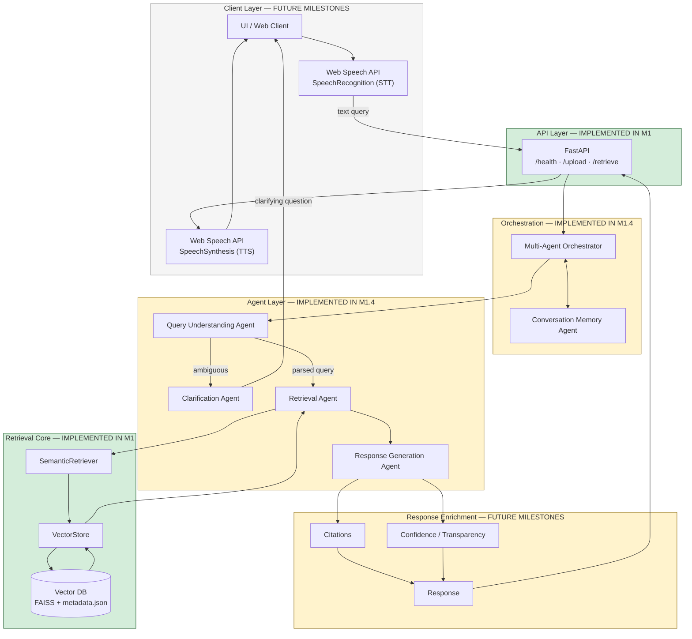
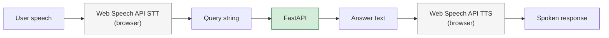

# System Architecture — RAG Multi-Agent Knowledge Assistant

Milestone 1.2 defines the **target system architecture** and marks what is live in M1
versus what ships in future milestones.

---

## 1. End-to-End System View

**M1 shortcut (today):** `UI` and agent/orchestrator layers are bypassed. Clients call
`POST /retrieve` directly; the API invokes `SemanticRetriever` → `VectorStore` → FAISS.

---

## 2. Layer Responsibilities

| Layer | Components | Status |
|---|---|---|
| Client | UI, Web Speech STT/TTS boundary | **FUTURE MILESTONES** |
| API | FastAPI endpoints, Pydantic validation | **IMPLEMENTED IN M1** |
| Orchestration | Multi-Agent Orchestrator, Conversation Memory | **IMPLEMENTED IN M1.4** |
| Agents | Query Understanding, Clarification, Retrieval, Response Generation | **IMPLEMENTED IN M1.4** |
| Retrieval Core | `SemanticRetriever`, `VectorStore`, FAISS index | **IMPLEMENTED IN M1** |
| Response | Citations, confidence, grounded answer | **IMPLEMENTED IN M1.4** |

---

## 3. Milestone 1 Scope (Implemented Today)

| Capability | Module | Status |
|---|---|---|
| Multi-format ingestion (PDF/DOCX/TXT/CSV) | `ingestion/` | **IMPLEMENTED IN M1** |
| Cleaning + token-aware chunking | `ingestion/cleaner.py`, `chunker.py` | **IMPLEMENTED IN M1** |
| Embeddings (`all-MiniLM-L6-v2`) | `vector_store/` | **IMPLEMENTED IN M1** |
| FAISS vector index + JSON metadata | `data/index.faiss`, `data/metadata.json` | **IMPLEMENTED IN M1** |
| Semantic Top-K retrieval | `retrieval/retriever.py` | **IMPLEMENTED IN M1** |
| Two-domain validation + Hit@1/3/5 | `evaluate_retrieval.py` | **IMPLEMENTED IN M1** |
| HTTP API | `app.py` | **IMPLEMENTED IN M1** |

See companion documents:

- [`ingestion-flow.md`](ingestion-flow.md) — upload → index pipeline
- [`rag-query-flow.md`](rag-query-flow.md) — query → evidence pipeline
- [`multi-agent-orchestration.md`](multi-agent-orchestration.md) — target agent routing

Schema definitions: [`../docs/data-models.md`](../docs/data-models.md)

Technology choices: [`../docs/tech-stack.md`](../docs/tech-stack.md)

Decision log: [`../docs/architecture-decisions.md`](../docs/architecture-decisions.md)

---

## 4. Storage (M1)

| Store | Path | Status |
|---|---|---|
| Vector index | `data/index.faiss` | **IMPLEMENTED IN M1** |
| Chunk metadata | `data/metadata.json` | **IMPLEMENTED IN M1** |
| Uploaded originals | `data/uploads/{uuid}.ext` | **IMPLEMENTED IN M1** |
| Managed vector DB | Qdrant / Pinecone | **FUTURE MILESTONES** |
| Session / conversation store | Redis / DB | **FUTURE MILESTONES** |

---

## 5. Voice Boundary

Speech runs **entirely in the browser** via the Web Speech API. The backend receives
and returns **plain text only**.

**Status:** STT/TTS boundary — **FUTURE MILESTONES**; text API — **IMPLEMENTED IN M1**.
