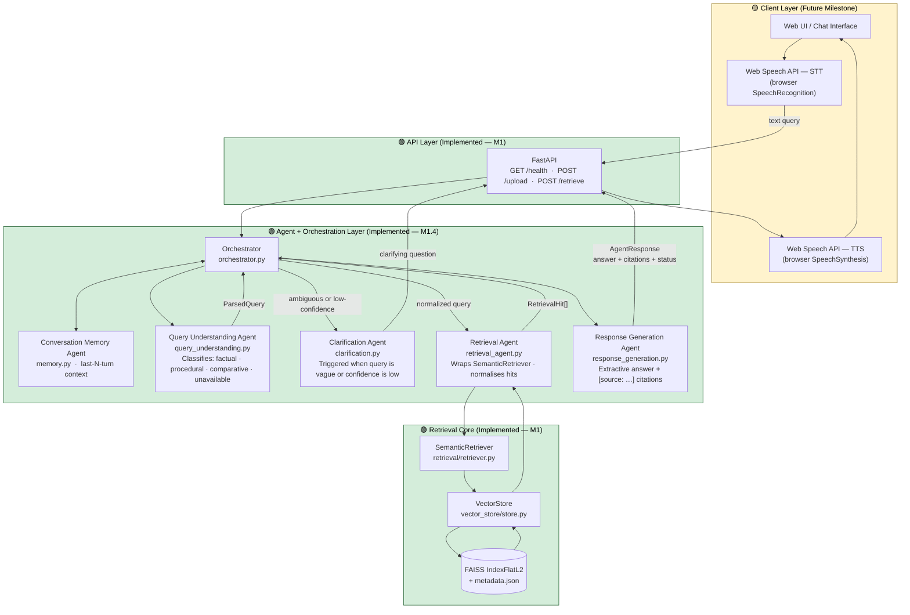

# System Architecture — RAG Multi-Agent Knowledge Assistant

> **Milestone 1 complete.** This document describes what is **live today** versus what is planned for future milestones.
> 🟢 Green = Implemented in M1 · 🟡 Yellow = Planned (Future Milestone)

---

## 1. End-to-End System Overview

> **Note on the API path today:** `POST /retrieve` calls `SemanticRetriever` directly (no agents).
> `POST /upload` uses character-based simple chunking.
> The full agent pipeline is invoked via the Python `Orchestrator` class in the test and evaluation scripts.

---

## 2. Layer Responsibilities

| Layer | Key Components | M1 Status |
|---|---|---|
| **Client** | Web UI, Web Speech API STT/TTS | 🟡 Future Milestone |
| **API** | FastAPI, Pydantic, `/health` `/upload` `/retrieve` | 🟢 Implemented |
| **Orchestrator** | `Orchestrator` class, intent routing, confidence gating | 🟢 Implemented (M1.4) |
| **Agents** | QueryUnderstanding, Clarification, Retrieval, ResponseGeneration, Memory | 🟢 Implemented (M1.4) |
| **Retrieval Core** | `SemanticRetriever`, `VectorStore`, FAISS L2 search | 🟢 Implemented |
| **Persistence** | `data/evaluation/index.faiss`, `data/evaluation/metadata.json` | 🟢 Implemented |
| **LLM Generation** | OpenAI / local model grounded answers | 🟡 Future Milestone |
| **Managed Vector DB** | Qdrant / Pinecone | 🟡 Future Milestone |

---

## 3. What Is Implemented in M1

| Capability | Module | Notes |
|---|---|---|
| PDF extraction | `ingestion/pdf_extractor.py` | Page text + page metadata, no OCR |
| DOCX extraction | `ingestion/docx_extractor.py` | Paragraphs + tables |
| TXT extraction | `ingestion/txt_extractor.py` | UTF-8, line count metadata |
| CSV extraction | `ingestion/csv_extractor.py` | Semantic row-text formatting |
| Text cleaning | `ingestion/cleaner.py` | Whitespace normalisation |
| Token-aware chunking | `ingestion/chunker.py` | tiktoken, 650 tokens, 75 overlap |
| Provenance validation | `ingestion/validator.py` | Chunk ↔ Document linkage check |
| Embeddings | `vector_store/embeddings.py` | all-MiniLM-L6-v2 · 384-d · CPU |
| Vector indexing | `vector_store/store.py` | FAISS IndexFlatL2 · duplicate-source guard |
| Semantic retrieval | `retrieval/retriever.py` | Top-K L2 search |
| Query Understanding | `agents/query_understanding.py` | Rule-based, no LLM |
| Retrieval Agent | `agents/retrieval_agent.py` | Normalises FAISS hits to `RetrievalHit` |
| Response Generation | `agents/response_generation.py` | Extractive excerpts + citations |
| Clarification Agent | `agents/clarification.py` | Question when vague/low-confidence |
| Conversation Memory | `agents/memory.py` | Last-N turns per session |
| Orchestrator | `agents/orchestrator.py` | Coordinates full pipeline |
| REST API | `app.py` | FastAPI, 3 endpoints |
| Evaluation harness | `evaluation/evaluate_retrieval.py` | Hit@1/3/5, failure analysis |

---

## 4. Storage

| Artifact | Path | Built by |
|---|---|---|
| Evaluation FAISS index | `data/evaluation/index.faiss` | `index_evaluation_corpus.py` |
| Evaluation metadata | `data/evaluation/metadata.json` | `index_evaluation_corpus.py` |
| Evaluation queries | `data/evaluation/queries.json` | `generate_evaluation_corpus.py` |
| Upload FAISS index | `data/index.faiss` | `POST /upload` or `index_samples.py` |
| Upload metadata | `data/metadata.json` | `POST /upload` or `index_samples.py` |
| Uploaded originals | `data/uploads/{uuid}.ext` | `POST /upload` |

---

## 5. Voice Boundary (Future)

The backend is **text-only**. Speech conversion lives entirely in the browser.

---

## 6. Related Documents

| Document | Purpose |
|---|---|
| [`ingestion-flow.md`](ingestion-flow.md) | Step-by-step ingestion pipeline |
| [`rag-query-flow.md`](rag-query-flow.md) | Query → evidence → answer pipeline |
| [`multi-agent-orchestration.md`](multi-agent-orchestration.md) | Agent routing logic |
| [`../docs/data-models.md`](../docs/data-models.md) | Schema field definitions |
| [`../docs/tech-stack.md`](../docs/tech-stack.md) | Technology choices and rationale |
| [`../docs/architecture-decisions.md`](../docs/architecture-decisions.md) | Decision log |
