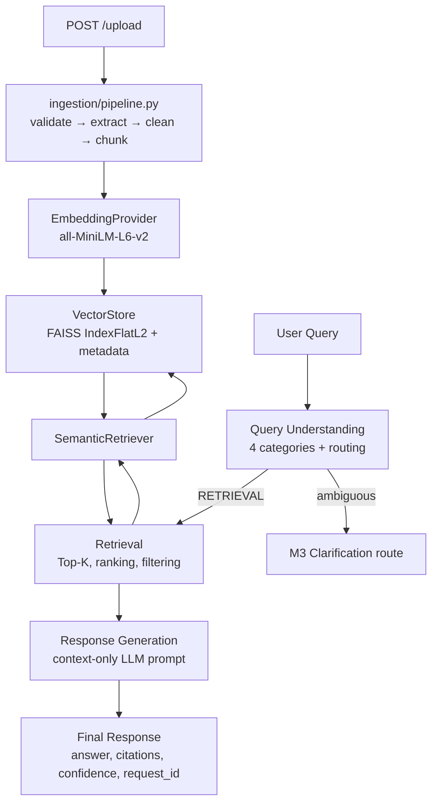

# System Architecture — M1 COMPLETED + M2 COMPLETED

This document describes the implemented system. M1 provides ingestion, embeddings,
FAISS storage, and retrieval. M2 adds deterministic query understanding, retrieval
normalization, grounded response generation, and fixed-sequence orchestration.

## Implemented: M1 + M2



### Query path

```text
User Query
    ↓
Query Understanding
    ↓
Retrieval
    ↓
Response Generation
    ↓
Final Response
```

Ambiguous queries take the implemented M2 boundary toward M3:

```text
Ambiguous
    ↓
Clarification route
    ↓
M3 clarification
```

The current route returns a structured clarification-needed response. It does not
perform autonomous planning, tool selection, multi-agent negotiation, or M3
multi-turn clarification.

## API

| Endpoint | Implemented behavior |
|---|---|
| `GET /health` | Liveness response |
| `POST /upload` | Full ingestion pipeline and FAISS/metadata persistence |
| `POST /retrieve` | Full M2 orchestrator |
| `POST /chat` | Compatibility alias for the M2 orchestrator |

`POST /retrieve` returns query type, classification confidence, answer, confidence
level, citations, retrieval summary/results, no-information state, clarification
state, and request ID. Internal API keys and provider objects are not exposed.

## Future: M3 and later

- Multi-turn clarification and conversational disambiguation
- Hybrid sparse+dense retrieval and cross-encoder reranking
- Web UI and browser voice features
- Managed vector databases and deployment infrastructure
