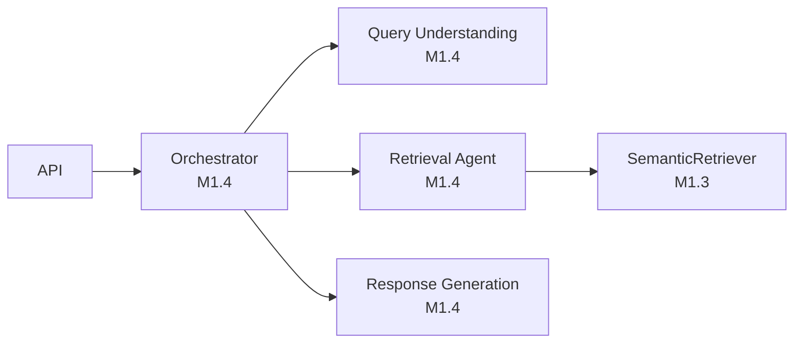

# Architecture Decisions — RAG Multi-Agent Knowledge Assistant

Decision log for Milestone 1.2. Each entry maps to implemented code or a documented
future boundary.

**Legend:** **IMPLEMENTED IN M1** · **FUTURE MILESTONES**

---

## AD-01: Thin Vertical Slice First

**Decision:** Ship one complete ingestion → retrieval path before agent or generation layers.

**Status:** **IMPLEMENTED IN M1**

**Rationale:** Produces testable evidence (Hit@1/3/5) and validates semantic search on the
two-domain corpus before adding LLM complexity.

---

## AD-02: Separate Ingestion and Query Lifecycles

**Decision:** Ingestion persists to disk; retrieval loads the index per process start.

| Path | Trigger | Status |
|---|---|---|
| Upload → embed → save | `POST /upload`, `index_samples.py` | **IMPLEMENTED IN M1** |
| Load → search | `POST /retrieve` | **IMPLEMENTED IN M1** |

**Rationale:** Incremental corpus growth without re-embedding at query time.

---

## AD-03: Unified Extraction Interface

**Decision:** All format logic lives in `ingestion/`; API and vector store are format-agnostic.

| Format | Library | Status |
|---|---|---|
| PDF | PyMuPDF | **IMPLEMENTED IN M1** |
| DOCX | python-docx | **IMPLEMENTED IN M1** |
| TXT | stdlib | **IMPLEMENTED IN M1** |
| CSV | pandas | **IMPLEMENTED IN M1** |

**Deferred:** OCR, HTML, image extraction — **FUTURE MILESTONES**.

---

## AD-04: Token-Aware Fixed-Size Chunking

**Decision:** 600-token chunks, 80-token overlap via tiktoken (`ingestion/chunker.py`).

**Status:** **IMPLEMENTED IN M1** (full pipeline); `app.py` still uses char-based
`simple_chunk()` — known integration gap.

**Deferred:** Semantic / sentence-boundary chunking — **FUTURE MILESTONES**.

---

## AD-05: Local Embedding Model

**Decision:** `sentence-transformers/all-MiniLM-L6-v2` (384-d) for chunks and queries.

**Status:** **IMPLEMENTED IN M1**

**Alternatives rejected for M1:** OpenAI embeddings (cost/API), mpnet (latency).

**Deferred:** Model comparison / fine-tuning — **FUTURE MILESTONES**.

---

## AD-06: FAISS IndexFlatL2 + JSON Metadata

**Decision:** In-process FAISS for vectors; parallel `metadata.json` keyed by row ID.

**Status:** **IMPLEMENTED IN M1**

**Deferred:** Qdrant / Pinecone — **FUTURE MILESTONES** when scale or concurrency requires.

---

## AD-07: FastAPI HTTP Layer

**Decision:** FastAPI + Pydantic for three endpoints.

**Status:** **IMPLEMENTED IN M1**

**Deferred:** Orchestrated `/chat` endpoint — **FUTURE MILESTONES**.

---

## AD-08: Retrieval Validated Before Generation

**Decision:** M1 proves retrieval quality; no LLM in the critical path.

**Status:** **IMPLEMENTED IN M1** (`evaluate_retrieval.py`, `docs/validation.md`)

**Deferred:** Response Generation Agent — **FUTURE MILESTONES**.

---

## AD-09: Multi-Agent Layer as Orchestrated Wrapper

**Decision:** Agents wrap existing retrieval; orchestrator routes by intent and ambiguity.

**Status:** **IMPLEMENTED IN M1.4** — all five agents (QueryUnderstanding, RetrievalAgent, ResponseGeneration, ClarificationAgent, ConversationMemory) plus Orchestrator ship in `agents/`.

---

## AD-10: Browser-Native Voice Boundary

**Decision:** Web Speech API handles STT/TTS in the client; backend is text-only.

**Status:** **FUTURE MILESTONES** (documented in `architecture/system-architecture.md`)

**Rationale:** No backend audio processing; reuse existing `/retrieve` contract.

---

## AD-11: Citations and Confidence from Retrieval Scores

**Decision:** `similarity_score` (L2) is the M1 transparency signal; normalised
`confidence` and inline `citations[]` attach at the Response Generation step.

| Signal | M1 | Future |
|---|---|---|
| Raw L2 distance | ✓ | |
| Normalised confidence (1/(1+L2)) | ✓ | |
| Inline citations in answer ([source:…]) | ✓ | |
| Unavailable-information guard | ✓ | |
| Cross-encoder re-ranking | | ✓ |

---

## AD-12: Honest Status Labelling

**Decision:** Components are labelled **IMPLEMENTED IN M1** only when executed with
verifiable output. Agent, UI, voice, and LLM layers remain **FUTURE MILESTONES** until
code ships.

**Status:** **IMPLEMENTED IN M1** (documentation policy)

---

## Related Documents

| Document | Purpose |
|---|---|
| [`architecture/system-architecture.md`](../architecture/system-architecture.md) | System overview |
| [`architecture/ingestion-flow.md`](../architecture/ingestion-flow.md) | Upload pipeline |
| [`architecture/rag-query-flow.md`](../architecture/rag-query-flow.md) | Query pipeline |
| [`architecture/multi-agent-orchestration.md`](../architecture/multi-agent-orchestration.md) | Agent routing |
| [`data-models.md`](data-models.md) | Schema definitions |
| [`tech-stack.md`](tech-stack.md) | Technology map |
