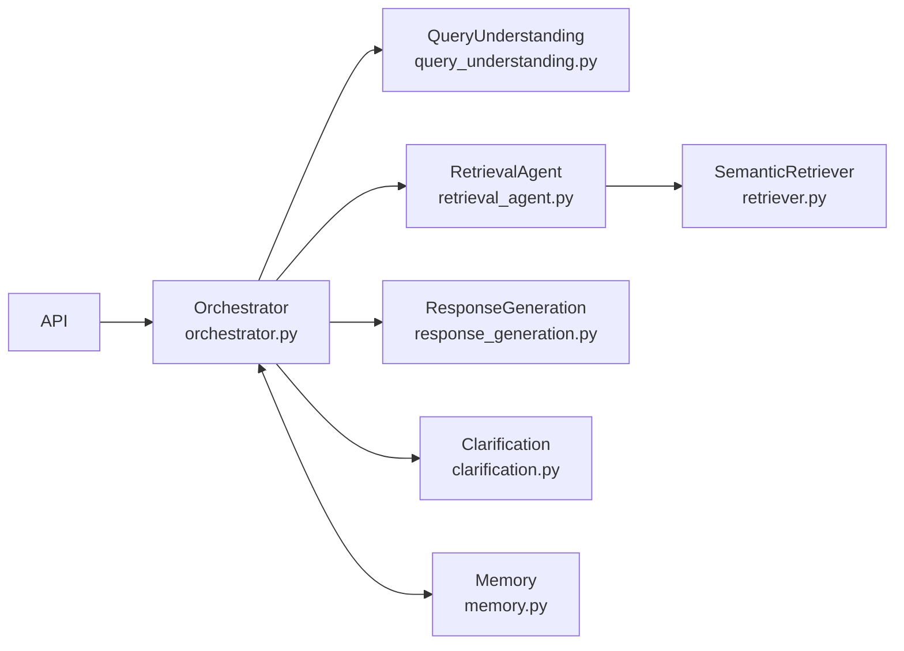

# Architecture Decisions — RAG Multi-Agent Knowledge Assistant

Decision log for Milestone 1. Each entry explains **what** was decided, **why**, and what its **current status** is.

> 🟢 = Implemented in M1 · 🟡 = Planned for future milestone

---

## AD-01: Thin Vertical Slice First

**Decision:** Build one complete ingestion → retrieval → agent path before adding LLM generation or a UI.

**Rationale:** Validates retrieval quality (Hit@1/3/5) on real document content before introducing LLM complexity. Failures are easier to diagnose and fix without a generation layer masking retrieval problems.

**Status:** 🟢 Implemented — full pipeline validated, 100% Hit@1/3/5 on 15 scored queries.

---

## AD-02: Separate Ingestion and Query Lifecycles

**Decision:** Ingestion writes to disk once; retrieval loads the index at process start.

| Operation | Trigger | Status |
|---|---|---|
| Ingest → embed → save | `index_evaluation_corpus.py` / `POST /upload` | 🟢 Implemented |
| Load → search | `VectorStore.load()` at startup | 🟢 Implemented |

**Rationale:** Corpus grows incrementally without re-embedding everything at query time. The FAISS index can be rebuilt from scratch at any time by re-running the ingestion scripts.

---

## AD-03: Unified Extraction Interface

**Decision:** All format-specific logic lives in `ingestion/`; the API and vector store are format-agnostic.

| Format | Library | Status |
|---|---|---|
| PDF | PyMuPDF | 🟢 Implemented |
| DOCX | python-docx | 🟢 Implemented |
| TXT | Python stdlib | 🟢 Implemented |
| CSV | pandas | 🟢 Implemented |
| OCR / scanned PDF | — | 🟡 Future |
| HTML / web pages | — | 🟡 Future |

**Rationale:** New formats only require adding an extractor class — no changes to the API or vector store.

---

## AD-04: Token-Aware Paragraph-Preserving Chunking

**Decision:** Use tiktoken with 650-token chunks, 75-token overlap, and paragraph/page/row boundary preference.

**Parameters:**

| Parameter | Value | Why |
|---|---|---|
| Chunk size | 650 tokens | Within the 500–800 token sweet spot for MiniLM |
| Overlap | 75 tokens | Preserves cross-boundary context |
| Max chunk size | 800 tokens | Hard cap; oversized segments are token-sliced |
| Tokeniser | `cl100k_base` | Deterministic; same as GPT tokenisers |
| Boundary preference | Paragraph → Page → CSV row → Token window | Keeps semantic units intact |

**Status:** 🟢 Implemented. `POST /upload` uses the full pipeline.

---

## AD-05: Local Embedding Model

**Decision:** Use `sentence-transformers/all-MiniLM-L6-v2` (384-d) for all chunk and query embeddings.

**Why chosen:**
- Runs on CPU — no GPU, no API key required
- Fast inference (~50ms per batch on modern CPU)
- Standard dense retrieval baseline with good benchmark performance
- Same model for chunks and queries ensures distance comparability

**Alternatives rejected for M1:**
- OpenAI embeddings: cost, API key dependency
- `all-mpnet-base-v2`: slower, higher latency, marginal quality gain for M1

**Status:** 🟢 Implemented in `vector_store/embeddings.py`.

---

## AD-06: FAISS IndexFlatL2 + JSON Metadata

**Decision:** Use in-process FAISS for vectors; parallel `metadata.json` keyed by FAISS row ID.

**Why FAISS:**
- Zero additional process or service to run
- Exact L2 search — no approximation, no tuning parameters
- Sufficient for M1 corpus size (8–100 chunks)
- Single `.faiss` file — easy to version, share, rebuild

**Metadata design:**
- Each FAISS row index maps to a JSON key containing the full chunk record
- `_indexed_sources` dict tracks which source files are indexed (for duplicate guard)

**Limitation:** FAISS `IndexFlatL2` always returns a nearest neighbour. M2
preserves L2 distance, derives `1 / (1 + distance)` relevance, and can filter
low-relevance results so unavailable queries produce no-evidence responses.

**Status:** 🟢 Implemented. Managed vector DB (Qdrant/Pinecone) deferred to 🟡 future.

---

## AD-07: FastAPI HTTP Layer

**Decision:** Three endpoints: `GET /health`, `POST /upload`, `POST /retrieve`.

| Endpoint | Purpose | Status |
|---|---|---|
| `GET /health` | Liveness check | 🟢 Implemented |
| `POST /upload` | Ingest a document through the full pipeline | 🟢 Implemented |
| `POST /retrieve` | Full M2 orchestrated response | 🟢 Implemented |
| `POST /chat` | Compatibility alias for M2 orchestration | 🟢 Implemented |

**Status:** 🟢 Implemented for M1 + M2.

---

## AD-08: Validate Retrieval Before Adding Generation

**Decision:** M1 proves retrieval quality with Hit@1/3/5 before introducing an LLM.

**Results (live run, `evaluation/evaluate_retrieval.py`):**

| Metric | Excl. unavailable | Incl. unavailable |
|---|---|---|
| Hit@1 | **100.0%** | 78.95% |
| Hit@3 | **100.0%** | 78.95% |
| Hit@5 | **100.0%** | 78.95% |

19 total queries · 15 scored · 4 unavailable-information (correctly rejected)

**Status:** Historical M1 decision superseded by AD-11 for M2.

---

## AD-09: Deterministic Sequential Agent Pipeline (No Framework)

**Decision:** Implement all agents as plain Python classes coordinated by a fixed-sequence `Orchestrator`. No LangGraph, no LangChain.



**Why no framework:**
- Deterministic behaviour — no LLM non-determinism
- Fully testable — 41 unit + integration tests, all passing
- No external dependencies or framework versioning issues
- Intent routing is rule-based regex, not probabilistic

**Status:** 🟢 Implemented for the fixed M2 sequence. The implementation does
not claim autonomous or agentic planning.

---

## AD-10: Browser-Native Voice Boundary

**Decision:** Web Speech API handles STT/TTS entirely in the client browser. The backend is text-only and never processes audio.

**Design:**
```
User speech → browser SpeechRecognition → text → POST /retrieve → text → browser SpeechSynthesis → spoken answer
```

**Rationale:** No audio codec, no streaming, no server-side model — the browser handles it for free.

**Status:** 🟡 Future — no UI shipped in M1. Backend text API is ready to receive the transcribed text.

---

## AD-11: Grounded LLM Responses with Citations (M2)

**Decision:** M2 answers are generated by a configured LLM using only supplied
retrieved context. Missing or insufficient evidence returns a controlled
no-information response.

| Signal | M1 + M2 status |
|---|---|
| Raw FAISS L2 distance | 🟢 Preserved as `distance_score` |
| Relevance `1/(1+distance)` | 🟢 Used by M2 retrieval |
| Metadata citations | 🟢 Created from retrieved hits |
| Context-only LLM generation | 🟢 Implemented when provider is configured |
| Calibrated confidence probability | ⚪ Not implemented |
| Cross-encoder reranking | 🟡 Future |

**Status:** 🟢 Implemented in `agents/response_generation.py`.

## AD-13: M2 Fixed Orchestration

**Decision:** Use the explicit sequence
`Query Understanding → Retrieval → Response Generation → Final Response`.
Ambiguous queries return a structured clarification-needed response. Request IDs
correlate the stages. Memory records turns but is not a required resolution
stage.

**Status:** 🟢 Implemented. Rich multi-turn clarification is M3 and later.

---

## AD-12: Honest Status Labelling

**Decision:** Components are labelled 🟢 Implemented only when code exists, tests pass, and output is verifiable.

**Status:** 🟢 Applied throughout all documentation.

---

## Related Documents

| Document | Purpose |
|---|---|
| [`architecture/system-architecture.md`](../architecture/system-architecture.md) | End-to-end system overview |
| [`architecture/ingestion-flow.md`](../architecture/ingestion-flow.md) | Ingestion pipeline detail |
| [`architecture/rag-query-flow.md`](../architecture/rag-query-flow.md) | Query pipeline detail |
| [`architecture/multi-agent-orchestration.md`](../architecture/multi-agent-orchestration.md) | Agent routing logic |
| [`data-models.md`](data-models.md) | Schema field definitions |
| [`tech-stack.md`](tech-stack.md) | Technology choices |
