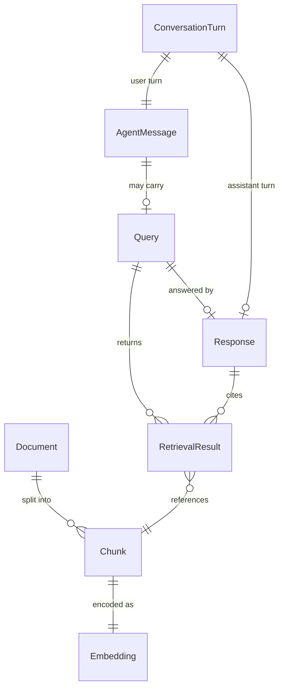

# Data Models — RAG Multi-Agent Knowledge Assistant

Canonical schemas for Milestone 1.2. Each model is tagged **IMPLEMENTED IN M1** or
**FUTURE MILESTONES**.

---

## Schema Overview



---

## 1. Document

Normalised output of format extraction.

**Status:** **IMPLEMENTED IN M1** (`ingestion/models.py`)

| Field | Type | Required | Description |
|---|---|---|---|
| `document_id` | `str` (UUID4) | yes | Unique ID per extraction run |
| `filename` | `str` | yes | Original basename with extension |
| `file_type` | `str` | yes | Lower-case dotted extension (`.pdf`, …) |
| `source` | `str` | yes | File path or source identifier |
| `created_at` | `str` (ISO 8601 UTC) | yes | Extraction timestamp |
| `text` | `str` | yes | Full extracted raw text |
| `metadata` | `dict` | no | Format-specific keys (page count, columns, …) |

```json
{
  "document_id": "a1b2c3d4-e5f6-7890-abcd-ef1234567890",
  "filename": "leave_policy.pdf",
  "file_type": ".pdf",
  "source": "data/hr/leave_policy.pdf",
  "created_at": "2026-03-09T12:00:00+00:00",
  "text": "Company Leave Policy ...",
  "metadata": {"page_count": 1, "format": "pdf"}
}
```

---

## 2. Chunk

Atomic indexed segment of a Document.

**Status:** **IMPLEMENTED IN M1** (`ingestion/models.py`, persisted via `VectorStore`)

| Field | Type | Required | Description |
|---|---|---|---|
| `chunk_id` | `str` | yes | `{document_id}_{chunk_index}` |
| `document_id` | `str` | yes | Parent document ID |
| `document_name` | `str` | yes | Human-readable filename |
| `chunk_index` | `int` | yes | 0-based position in parent |
| `text` | `str` | yes | Chunk body (~600 tokens) |
| `source_location` | `str` | yes | Parent file path |
| `metadata` | `dict` | no | Token counts, char offsets, format keys |

---

## 3. Embedding

Dense vector for a Chunk or Query.

**Status:** **IMPLEMENTED IN M1** (vectors in FAISS; abstraction in `vector_store/embeddings.py`)

| Field | Type | Required | Description |
|---|---|---|---|
| `vector` | `float32[]` length 384 | yes | Dense embedding |
| `model_name` | `str` | yes | `"all-MiniLM-L6-v2"` |
| `source_type` | `str` | yes | `"chunk"` or `"query"` |
| `source_id` | `str` | no | `chunk_id` when source is chunk |

Embeddings are stored inside `data/index.faiss`, not as a separate artefact.

---

## 4. Query

User information request.

**Status:** **IMPLEMENTED IN M1** (`app.py` `RetrieveRequest`; extended in eval harness)

| Field | Type | Required | Description |
|---|---|---|---|
| `query` | `str` | yes | Raw natural-language text |
| `top_k` | `int` | no | Results to return (default 3) |

**Eval extensions** (**IMPLEMENTED IN M1** — `evaluate_retrieval.py` only):

| Field | Type | Description |
|---|---|---|
| `query_id` | `str` | Test case ID (`q1` … `q8`) |
| `domain` | `str` | `HR` or `Software` |
| `query_type` | `str` | Factual · Procedural · Comparative · Unavailable-information |
| `expected_source` | `str` | Expected top document or `NONE` |

**Future extensions** (**FUTURE MILESTONES**):

| Field | Type | Description |
|---|---|---|
| `session_id` | `str` | Conversation session |
| `parsed_intent` | `str` | From Query Understanding Agent |
| `parsed_domain` | `str` | From Query Understanding Agent |

---

## 5. RetrievalResult

Ranked evidence chunk returned from vector search.

**Status:** **IMPLEMENTED IN M1** (`vector_store/store.py` → `SemanticRetriever`)

| Field | Type | Required | Description |
|---|---|---|---|
| `chunk_id` | `str` | yes | Retrieved chunk identifier |
| `document_id` | `str` | yes | Parent document ID |
| `document_name` | `str` | yes | Source filename |
| `source_location` | `str` | yes | Source file path |
| `text` | `str` | yes | Chunk text content |
| `similarity_score` | `float` | yes | L2 distance (lower = closer) |
| `rank` | `int` | no | 1-based rank in result set |

```json
{
  "chunk_id": "a1b2c3d4_0",
  "document_id": "a1b2c3d4-e5f6-7890-abcd-ef1234567890",
  "document_name": "leave_policy.pdf",
  "source_location": "data/hr/leave_policy.pdf",
  "text": "Annual Leave Entitlement ...",
  "similarity_score": 0.6975,
  "rank": 1
}
```

---

## 6. Response

Final answer returned to the user.

**Status:** **FUTURE MILESTONES**

| Field | Type | Required | Description |
|---|---|---|---|
| `answer` | `str` | yes | Grounded natural-language answer |
| `citations` | `Citation[]` | no | Evidence references |
| `confidence` | `float` | no | Normalised 0–1 retrieval confidence |
| `query_id` | `str` | no | Originating query / turn ID |
| `session_id` | `str` | no | Conversation session |
| `status` | `str` | yes | `answered` · `unavailable` · `clarification_needed` |
| `retrieval_results` | `RetrievalResult[]` | no | Evidence used (transparency) |

**Citation** (nested):

| Field | Type | Description |
|---|---|---|
| `chunk_id` | `str` | Cited chunk |
| `document_name` | `str` | Source document |
| `excerpt` | `str` | Short quoted span |

---

## 7. AgentMessage

Unit passed between UI, API, and agents.

**Status:** **FUTURE MILESTONES**

| Field | Type | Required | Description |
|---|---|---|---|
| `message_id` | `str` (UUID4) | yes | Unique message ID |
| `session_id` | `str` | yes | Conversation session |
| `role` | `str` | yes | `user` · `assistant` · `system` |
| `content` | `str` | yes | Message text |
| `timestamp` | `str` (ISO 8601) | yes | Creation time |
| `metadata` | `dict` | no | Intent, domain, channel (`text` / `voice`) |

---

## 8. ConversationTurn

One user–assistant exchange in a session.

**Status:** **FUTURE MILESTONES**

| Field | Type | Required | Description |
|---|---|---|---|
| `turn_id` | `str` (UUID4) | yes | Turn identifier |
| `session_id` | `str` | yes | Parent session |
| `turn_index` | `int` | yes | 0-based turn number |
| `user_message` | `AgentMessage` | yes | User input (text or STT output) |
| `assistant_message` | `AgentMessage` | no | Clarification or final answer |
| `query` | `Query` | no | Parsed query sent to retrieval |
| `response` | `Response` | no | Final answer when produced |
| `created_at` | `str` (ISO 8601) | yes | Turn timestamp |

---

## Status Summary

| Schema | M1 | Future |
|---|---|---|
| Document | ✓ | |
| Chunk | ✓ | |
| Embedding | ✓ | |
| Query (core) | ✓ | session / parsed fields |
| RetrievalResult | ✓ | normalised rank field |
| Response | | ✓ |
| AgentMessage | | ✓ |
| ConversationTurn | | ✓ |
