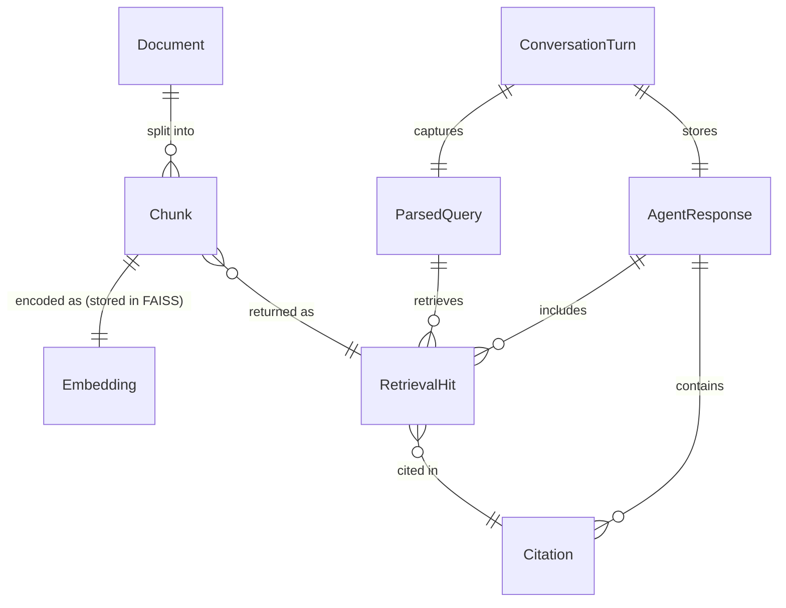

# Data Models — RAG Multi-Agent Knowledge Assistant

Canonical schemas for all data structures used in Milestones 1 and 2.
🟢 = Implemented in M1 · 🟡 = Planned for future milestone

---

## Schema Relationships



---

## 1. Document 🟢

Output of format extraction. Produced by `extract_document()` in `ingestion/extractor.py`.

| Field | Type | Description |
|---|---|---|
| `document_id` | `str` UUID4 | Unique ID for this extraction run |
| `filename` | `str` | Original basename e.g. `leave_policy.pdf` |
| `file_type` | `str` | Lower-case dotted extension: `.pdf` · `.docx` · `.txt` · `.csv` |
| `source` | `str` | Full file path passed to the extractor |
| `created_at` | `str` ISO 8601 UTC | Timestamp of extraction |
| `text` | `str` | Complete extracted text |
| `metadata` | `dict` | Format-specific fields (see below) |

**Format-specific metadata keys:**

| Format | Keys |
|---|---|
| PDF | `page_count`, `page_texts[]`, `empty_page_count`, `has_text`, `pdf_producer` |
| DOCX | `paragraph_count`, `table_count` |
| TXT | `line_count`, `char_count` |
| CSV | `row_count`, `column_names`, `column_count` |

```json
{
  "document_id": "a1b2c3d4-e5f6-7890-abcd-ef1234567890",
  "filename": "leave_policy.pdf",
  "file_type": ".pdf",
  "source": "data/hr/leave_policy.pdf",
  "created_at": "2026-09-10T06:00:00+00:00",
  "text": "Company Leave Policy ...",
  "metadata": { "page_count": 3, "has_text": true, "format": "pdf" }
}
```

---

## 2. Chunk 🟢

Atomic indexed segment. Produced by `TextChunker.chunk_document()` in `ingestion/chunker.py`.
Persisted as rows in `metadata.json`, keyed by FAISS row index.

| Field | Type | Description |
|---|---|---|
| `chunk_id` | `str` | `"{document_id}_{chunk_index}"` — deterministic |
| `document_id` | `str` | Parent document UUID |
| `document_name` | `str` | Human-readable filename |
| `chunk_index` | `int` | 0-based position within parent document |
| `text` | `str` | Chunk body (~650 tokens target) |
| `source_location` | `str` | Parent file path |
| `metadata` | `dict` | Token counts, char offsets, domain, format keys |

**Chunk metadata keys:**

| Key | Description |
|---|---|
| `token_count` | Actual token count for this chunk |
| `token_start` / `token_end` | Token offset range within the document |
| `char_count` | Character length |
| `filename` / `file_type` | Inherited from parent document |
| `domain` | Knowledge domain label (e.g. `"Software Engineering"`) |
| `page_number` / `page_start` / `page_end` | PDF pages covered (PDF only) |
| `row_number` / `row_start` / `row_end` | CSV rows covered (CSV only) |
| `embedding_model` | `"all-MiniLM-L6-v2"` — stored in `metadata.json` |

---

## 3. Embedding 🟢

Dense float32 vector. Produced by `EmbeddingProvider` in `vector_store/embeddings.py`.
Stored inside `data/evaluation/index.faiss` — not a separate file.

| Property | Value |
|---|---|
| Model | `all-MiniLM-L6-v2` |
| Dimensions | 384 |
| Dtype | `float32` |
| Distance metric | L2 (Euclidean) |
| Scope | Both document chunks and user queries |

---

## 4. QueryUnderstandingResult 🟢

Structured M2 output from query understanding.

| Field | Type | Description |
|---|---|---|
| `query` | `str` | Original query |
| `normalized_query` | `str` | Whitespace-normalised query |
| `query_type` | `str` | `factual` · `procedural` · `comparative` · `ambiguous` |
| `classification_confidence` | `float` | Deterministic application-level classification signal; not calibrated probability |
| `routing` | `str` | `RETRIEVAL` or `CLARIFICATION` |
| `domain` | `str \| None` | Detected knowledge domain |
| `reason` | `str` | Explanation for classification and routing |

## 5. ParsedQuery 🟢

Legacy compatibility model. The M2 public output is `QueryUnderstandingResult`.

| Field | Type | Description |
|---|---|---|
| `raw_query` | `str` | Original user input |
| `normalized_query` | `str` | Whitespace-normalised text |
| `query_type` | `str` | `factual` · `procedural` · `comparative` · `ambiguous` |
| `domain` | `str \| None` | `"Software Engineering"` · `"Hospital Administration"` · `None` |
| `is_ambiguous` | `bool` | True if query is too short or uses vague pronouns |

---

## 6. RetrievalResult 🟢

Structured M2 retrieval-stage output containing ranked hits and evidence sufficiency.

| Field | Type | Description |
|---|---|---|
| `query` | `str` | Query sent to retrieval |
| `query_type` | `str` | Query type from understanding |
| `top_k` | `int` | Requested result count |
| `results` | `RetrievalHit[]` | Ranked retrieval hits |
| `filtered_count` | `int` | Hits removed by retrieval filtering |
| `retrieval_confidence` | `float` | Highest derived relevance among retained hits |
| `sufficient_evidence` | `bool` | Whether evidence is sufficient to answer |
| `no_relevant_information` | `bool` | Whether no relevant evidence was found |

## 7. RetrievalHit 🟢

One ranked result from `RetrievalAgent.retrieve()` in `agents/retrieval_agent.py`.

| Field | Type | Description |
|---|---|---|
| `rank` | `int` | 1-based position in results |
| `relevance_score` | `float` | Derived relevance `1 / (1 + distance_score)`; higher is better |
| `distance_score` | `float` | Original FAISS L2 distance; lower is better |
| `text` | `str` | Chunk body text |
| `document_id` | `str` | Parent document UUID |
| `filename` | `str` | Source document filename |
| `chunk_id` | `str` | `"{document_id}_{chunk_index}"` |
| `metadata` | `dict` | Domain, file_type, token counts |

```json
{
  "rank": 1,
  "relevance_score": 0.4821,
  "distance_score": 1.073,
  "text": "Sprint duration is typically two weeks ...",
  "document_id": "b2c3d4e5-...",
  "filename": "microservices_architecture.pdf",
  "chunk_id": "b2c3d4e5-..._0",
  "metadata": { "domain": "Software Engineering", "file_type": ".pdf" }
}
```

---

## 8. Citation 🟢

Inline source reference attached to an `AgentResponse`.
Produced by `ResponseGenerationAgent`.

| Field | Type | Description |
|---|---|---|
| `chunk_id` | `str` | Cited chunk identifier |
| `filename` | `str` | Source document filename |
| `excerpt` | `str` | Short text span used in the answer (≤400 chars) |
| `document_id` | `str` | Parent document UUID |

---

## 9. ResponseResult 🟢

Structured M2 response-generation output.

| Field | Type | Description |
|---|---|---|
| `answer` | `str` | Grounded generated answer, clarification, or controlled no-information response |
| `citations` | `Citation[]` | Supporting source references |
| `confidence` | `float` | Application-level confidence inherited from retrieval |
| `confidence_level` | `str` | Human-readable confidence level |
| `grounded` | `bool` | Whether the answer is grounded in retrieved evidence |
| `no_information_found` | `bool` | Whether no answerable evidence was found |
| `query_type` | `str` | Query type used for generation |
| `classification_confidence` | `float` | Classification-stage confidence |
| `status` | `str` | `answered`, `unavailable`, `clarification_needed`, or `error` |
| `request_id` | `str` | Correlation identifier for the request |
| `retrieval` | `RetrievalResult \| None` | Structured retrieval handoff |
| `error` | `AgentError \| None` | Structured stage error |

## 10. AgentError 🟡

Standardized error returned by an agent stage.

| Field | Type | Description |
|---|---|---|
| `agent` | `str` | Agent/stage name |
| `code` | `str` | Stable error code |
| `message` | `str` | Human-readable error |

## 11. AgentResponse 🟢

Legacy compatibility model. The M2 orchestrator returns `ResponseResult`.

| Field | Type | Description |
|---|---|---|
| `answer` | `str` | Answer text, clarifying question, or unavailability message |
| `citations` | `Citation[]` | Source references (up to 3) |
| `status` | `str` | `"answered"` · `"unavailable"` · `"clarification_needed"` |
| `intent` | `str` | Compatibility alias for `query_type` |
| `confidence` | `float` | Application-level retrieval confidence; not calibrated |
| `retrieval_hits` | `RetrievalHit[]` | Full ranked hit list |
| `domain` | `str \| None` | Detected domain |
| `clarification_question` | `str \| None` | Set when `status="clarification_needed"` |

```json
{
  "answer": "Sprint duration is typically two weeks. [source: microservices_architecture.pdf]",
  "citations": [{ "chunk_id": "b2c3d4_0", "filename": "microservices_architecture.pdf", "excerpt": "Sprint duration is typically two weeks ..." }],
  "status": "answered",
  "intent": "factual",
  "confidence": 0.67,
  "domain": "Software Engineering"
}
```

---

## 12. ConversationTurn 🟢

One user–assistant exchange, stored in `ConversationMemoryAgent`.
In-memory only — not persisted to disk in M1.

| Field | Type | Description |
|---|---|---|
| `session_id` | `str` | Conversation identifier |
| `query` | `str` | User's question for this turn |
| `answer` | `str` | Agent's answer for this turn |
| `turn_index` | `int` | 0-based turn number within the session |

---

## 13. API Schemas

### POST /upload response

| Field | Type | Description |
|---|---|---|
| `document_id` | `str` | UUID assigned to the uploaded document |
| `filename` | `str` | Original filename |
| `file_type` | `str` | Extension (`.pdf`, `.docx`, `.txt`, `.csv`) |
| `chunk_count` | `int` | Number of chunks indexed |
| `metadata` | `dict` | Extractor metadata |

### POST /retrieve request

| Field | Type | Default | Description |
|---|---|---|---|
| `query` | `str` | required | Natural language question |
| `top_k` | `int` | 3 | Number of results to return |

### POST /retrieve response

| Field | Type | Description |
|---|---|---|
| `query` | `str` | Echo of the input query |
| `results` | `list` | List of chunk metadata dicts with `similarity_score` |

---

## 14. Status Summary

| Model | M1 Status | Module |
|---|---|---|
| `Document` | 🟢 Implemented | `ingestion/models.py` |
| `Chunk` | 🟢 Implemented | `ingestion/models.py` |
| `Embedding` | 🟢 Implemented (in FAISS) | `vector_store/embeddings.py` |
| `ParsedQuery` | 🟢 Implemented | `agents/models.py` |
| `QueryUnderstandingResult` | 🟡 Contract added | `agents/models.py` |
| `RetrievalHit` | 🟢 Implemented | `agents/models.py` |
| `RetrievalResult` | 🟡 Contract added | `agents/models.py` |
| `Citation` | 🟢 Implemented | `agents/models.py` |
| `ResponseResult` | 🟡 Contract added | `agents/models.py` |
| `AgentError` | 🟡 Contract added | `agents/models.py` |
| `AgentResponse` | 🟢 Implemented | `agents/models.py` |
| `ConversationTurn` | 🟢 Implemented (in-memory) | `agents/models.py` |
| Persistent session store | 🟡 Future | Redis / SQLite (M2+) |
| `AgentMessage` (UI protocol) | 🟡 Future | Chat UI layer (M2+) |
