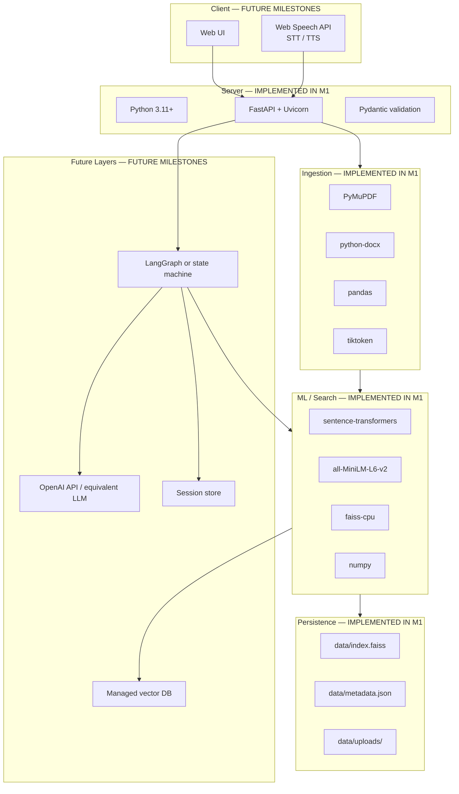

# Technology Stack — RAG Multi-Agent Knowledge Assistant

Reuses existing M1 technology choices. Status labels: **IMPLEMENTED IN M1** or
**FUTURE MILESTONES**.

---

## Stack Diagram

---

## Component Table

| Layer | Technology | Version / Notes | Status |
|---|---|---|---|
| Language | Python | 3.11+ | **IMPLEMENTED IN M1** |
| HTTP server | Uvicorn | ASGI | **IMPLEMENTED IN M1** |
| API framework | FastAPI | `/health`, `/upload`, `/retrieve` | **IMPLEMENTED IN M1** |
| Request validation | Pydantic | `RetrieveRequest` | **IMPLEMENTED IN M1** |
| Multipart uploads | python-multipart | File upload | **IMPLEMENTED IN M1** |
| PDF extraction | PyMuPDF (`fitz`) | Local, no OCR | **IMPLEMENTED IN M1** |
| DOCX extraction | python-docx | Paragraph + table text | **IMPLEMENTED IN M1** |
| CSV processing | pandas | Semantic row formatting | **IMPLEMENTED IN M1** |
| TXT processing | Python stdlib | UTF-8 read | **IMPLEMENTED IN M1** |
| Token counting | tiktoken | `cl100k_base` for chunking | **IMPLEMENTED IN M1** |
| Embeddings | sentence-transformers | CPU inference | **IMPLEMENTED IN M1** |
| Embedding model | all-MiniLM-L6-v2 | 384-d, 22M params | **IMPLEMENTED IN M1** |
| Vector search | faiss-cpu | `IndexFlatL2` | **IMPLEMENTED IN M1** |
| Numerics | numpy | float32 vectors | **IMPLEMENTED IN M1** |
| Metadata store | JSON file | `data/metadata.json` | **IMPLEMENTED IN M1** |
| Sample generation | fpdf | Synthetic PDF corpus | **IMPLEMENTED IN M1** |
| API testing | httpx | `test_app.py` | **IMPLEMENTED IN M1** |
| LLM generation | OpenAI API | Grounded answers | **FUTURE MILESTONES** |
| Env config | python-dotenv | API keys | **FUTURE MILESTONES** |
| Orchestration | LangGraph / custom FSM | Agent routing | **FUTURE MILESTONES** |
| Frontend UI | React or static HTML | Chat interface | **FUTURE MILESTONES** |
| Voice | Web Speech API | Browser STT/TTS | **FUTURE MILESTONES** |
| Vector DB | Qdrant / Pinecone | Production scale | **FUTURE MILESTONES** |
| Session store | Redis / SQLite | Conversation memory | **FUTURE MILESTONES** |
| Auth | OAuth / API keys | Multi-user | **FUTURE MILESTONES** |
| Deployment | Docker / cloud | Production hosting | **FUTURE MILESTONES** |

---

## Dependencies (`requirements.txt`)

| Package | Purpose | Status |
|---|---|---|
| fastapi | API | **IMPLEMENTED IN M1** |
| uvicorn | Server | **IMPLEMENTED IN M1** |
| python-multipart | Uploads | **IMPLEMENTED IN M1** |
| pymupdf | PDF | **IMPLEMENTED IN M1** |
| python-docx | DOCX | **IMPLEMENTED IN M1** |
| pandas | CSV | **IMPLEMENTED IN M1** |
| numpy | Arrays | **IMPLEMENTED IN M1** |
| sentence-transformers | Embeddings | **IMPLEMENTED IN M1** |
| faiss-cpu | Vector index | **IMPLEMENTED IN M1** |
| fpdf | Sample PDFs | **IMPLEMENTED IN M1** |
| tiktoken | Chunking | **IMPLEMENTED IN M1** |
| httpx | Tests | **IMPLEMENTED IN M1** |
| openai | LLM | **FUTURE MILESTONES** (commented) |
| python-dotenv | Config | **FUTURE MILESTONES** (commented) |

---

## Design Constraints (M1)

- **Local-first:** no external API required for ingestion or retrieval.
- **Swappable embedding model:** change constructor param in `VectorStore` / `EmbeddingService`.
- **Swappable vector backend:** `VectorStore` interface hides FAISS details.
- **Retrieval before generation:** LLM deferred until retrieval baseline is validated.
