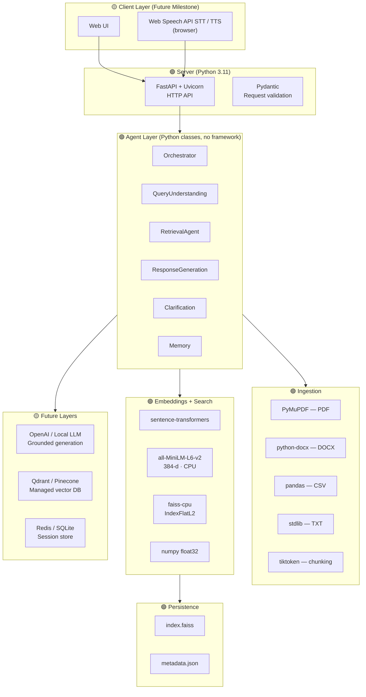

# Technology Stack — RAG Multi-Agent Knowledge Assistant

M1 retrieval and M2 deterministic stages run locally. M2 response generation can
use the OpenAI API when `OPENAI_API_KEY` is configured; tests use injected mocks.

> 🟢 = Implemented and in use · 🟡 = Planned for future milestone

---

## Stack at a Glance



---

## Component Reference

### Core Runtime

| Component | Technology | Notes |
|---|---|---|
| Language | **Python 3.11** | Type hints throughout, dataclasses |
| HTTP server | **Uvicorn** | ASGI |
| API framework | **FastAPI** | `/health` · `/upload` · `/retrieve` |
| Request validation | **Pydantic** | `RetrieveRequest` model |
| File uploads | **python-multipart** | Multipart form support |

### Document Ingestion

| Component | Technology | What it extracts |
|---|---|---|
| PDF | **PyMuPDF** (`fitz`) | Text per page, page metadata, no OCR |
| DOCX | **python-docx** | Paragraphs + table text in body order |
| CSV | **pandas** | `"Column: Value"` semantic row strings |
| TXT | **Python stdlib** | Raw UTF-8 text with line count |
| Tokeniser | **tiktoken** (`cl100k_base`) | Deterministic token counting for chunking |

### Embeddings and Search

| Component | Technology | Notes |
|---|---|---|
| Embedding model | **all-MiniLM-L6-v2** | 384 dimensions · 22M params · local CPU inference |
| Model runner | **sentence-transformers** | Wraps HuggingFace model |
| Vector index | **faiss-cpu `IndexFlatL2`** | Exact L2 nearest-neighbour search |
| Numerics | **numpy** | float32 vectors |
| Metadata store | **JSON file** | `metadata.json` keyed by FAISS row index |

### Agent Layer

| Component | Technology | Notes |
|---|---|---|
| All agents | **Plain Python classes** | No LangGraph, no LangChain |
| Intent classification | **Regex pattern matching** | No LLM required |
| Conversation memory | **In-process deque** | Per session_id, max 5 turns |

### Testing

| Component | Technology | Notes |
|---|---|---|
| Test runner | **pytest** | 41 tests, all passing |
| HTTP test client | **httpx** (via FastAPI TestClient) | Integration tests for API |
| Synthetic corpus | **fpdf** | Generates PDF files for evaluation |

---

## `requirements.txt`

```
# Runtime — all needed for M1
fastapi
uvicorn
python-multipart
pymupdf
python-docx
pandas
numpy
sentence-transformers
faiss-cpu
fpdf
tiktoken

# Test
httpx
pytest

# Future (commented out — not imported in M1)
# openai
# python-dotenv
```

---

## Chunking Configuration

| Parameter | Value | Rationale |
|---|---|---|
| Chunk size | **650 tokens** | Balances context richness vs embedding noise |
| Overlap | **75 tokens** | Preserves context across chunk boundaries |
| Max chunk size | **800 tokens** | Hard cap; oversized blocks are token-sliced |
| Tokeniser | **`cl100k_base`** | Same tokeniser as GPT — deterministic counts |

---

## Evaluation Configuration

| Parameter | Value |
|---|---|
| Embedding model | `all-MiniLM-L6-v2` |
| Index type | FAISS `IndexFlatL2` |
| Domains | Software Engineering · Hospital Administration |
| Query types | Factual · Procedural · Comparative · Unavailable |
| Evaluated top-k | 1, 3, 5 |
| Hit@1 / Hit@3 / Hit@5 | **100% / 100% / 100%** (15 scorable queries) |

---

## Design Principles

| Principle | How it's applied |
|---|---|
| **Local-first** | No external API needed; model runs on CPU |
| **Retrieval before generation** | LLM deferred; retrieval quality validated first |
| **Swappable embeddings** | Change one param in `VectorStore(model_name=…)` |
| **Swappable vector backend** | `VectorStore` interface hides FAISS internals |
| **No secrets in code** | `openai` / `python-dotenv` commented out in requirements |
| **Testable determinism** | Rule-based agents; no LLM non-determinism |

---

## Future Stack Additions (M3+)

| Layer | Technology | Reason |
|---|---|---|
| LLM generation | OpenAI API / local LLM | Grounded answers instead of extractive |
| Config / secrets | python-dotenv | API key management |
| Frontend | React or plain HTML | Chat interface |
| Voice | Web Speech API | Browser STT/TTS |
| Vector DB | Qdrant / Pinecone | Multi-user, persistent, scalable |
| Session store | Redis / SQLite | Multi-turn memory across restarts |
| Auth | OAuth / API keys | Multi-user support |
| Deployment | Docker + cloud | Production hosting |
